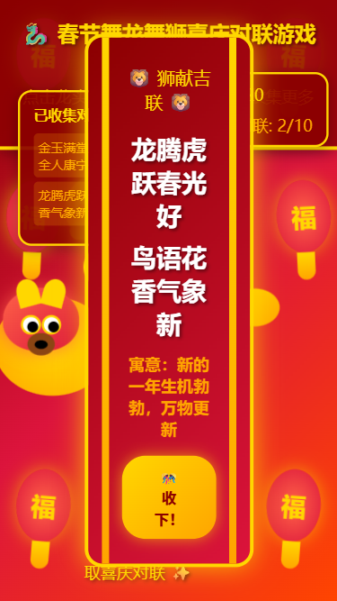
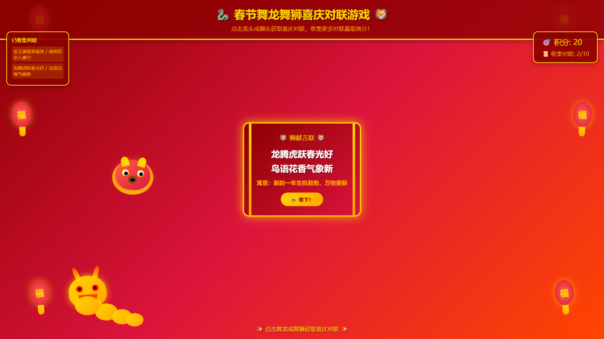

# 【新春创造营】春节舞龙舞狮喜庆对联游戏

## 📖 项目介绍

这是一个充满年味的春节主题小游戏，通过点击舞动的龙和狮来收集喜庆的对联。游戏融合了传统春节文化与现代网页技术，让玩家在游戏中感受春节的欢乐氛围。

**项目类型：** 春节主题互动小游戏

**技术栈：** HTML5 + CSS3 + JavaScript（纯前端实现）

## 🎮 游戏特色

### 核心玩法
- 🐉 **舞龙互动**：点击金色舞龙获取"龙赐福联"
- 🦁 **舞狮互动**：点击红色舞狮获取"狮献吉联"
- 📜 **对联收集**：共10副精选春节对联，每副包含上联、下联和寓意
- 🎯 **积分系统**：每收集一副对联获得10分
- 🏆 **通关目标**：收集完所有10副对联即可通关

### 视觉效果
- 🏮 喜庆的红色渐变背景
- 🏮 摇摆的灯笼装饰
- 🎆 点击时的烟花特效
- 🎨 金色边框和精美的弹窗设计
- ✨ 舞龙舞狮自动舞动和移动

### 响应式设计
- 支持桌面端和移动端
- 自动适配不同屏幕尺寸

## 🤖 如何利用 iFlow CLI 创建这个游戏

### 第一步：通过自然语言描述需求

我向 iFlow CLI 描述了游戏需求：
> "根据活动要求，我们做一个春节舞龙舞狮的小游戏，龙头狮头会突出喜庆的对联"

iFlow CLI 理解了我的意图，并主动提出了以下问题来确认需求：
- 游戏的核心玩法是什么？
- 需要哪些视觉元素？
- 对联如何展示？
- 有什么特殊的交互要求？

### 第二步：iFlow CLI 自动规划开发流程

iFlow CLI 使用 `todo_write` 工具自动创建了详细的任务清单：
- 设计游戏整体架构和功能规划
- 创建HTML页面结构和基础布局
- 实现舞龙舞狮的动画效果
- 添加对联显示和交互功能
- 添加喜庆背景和装饰
- 使用frontend-tester验证游戏功能

整个过程不需要我手动编写任何任务列表，iFlow CLI 自动完成了项目规划。

### 第三步：通过自然语言描述功能实现

我继续用自然语言向 iFlow CLI 描述具体功能需求：

**关于舞龙舞狮：**
> "要有一条金色的舞龙和红色的舞狮，它们需要有舞动的动画效果，会自动在屏幕上移动"

**关于对联系统：**
> "需要10副春节对联，每副对联包含上联、下联和寓意。点击龙头显示'龙赐福联'，点击狮头显示'狮献吉联'"

**关于游戏玩法：**
> "玩家点击舞龙或舞狮获取对联，每收集一副对联获得10分，收集完所有对联就通关"

**关于视觉效果：**
> "要有喜庆的红色背景、摇摆的灯笼装饰、点击时要有烟花效果，整体要符合春节氛围"

**关于响应式设计：**
> "游戏要支持手机和电脑，自动适配不同屏幕"

### 第四步：iFlow CLI 自动生成完整代码

基于我的自然语言描述，iFlow CLI 自动生成了完整的游戏代码：

- **HTML结构**：创建了游戏容器、舞龙舞狮元素、对联弹窗、状态面板等
- **CSS样式**：实现了红色渐变背景、灯笼装饰、舞龙舞狮的CSS动画、烟花特效、响应式布局
- **JavaScript逻辑**：实现了对联数据管理、点击事件处理、烟花粒子系统、积分系统、自动移动逻辑

整个过程我只用了自然语言描述需求，没有编写任何代码。

### 第五步：iFlow CLI 自动测试验证

代码生成后，iFlow CLI 自动调用了 `frontend-tester` 进行功能测试：

- ✅ 测试页面正常加载
- ✅ 验证舞龙舞狮显示和点击功能
- ✅ 检查对联弹窗显示和内容
- ✅ 测试积分和收集系统
- ✅ 验证响应式设计（桌面端和移动端）
- ✅ 检查控制台是否有错误

测试结果：所有功能正常，无需手动调试！

### 整个开发过程总结

从需求描述到完成游戏，我全程只使用了自然语言与 iFlow CLI 交互：

1. **描述需求** → iFlow CLI 理解并确认细节
2. **自动规划** → iFlow CLI 创建任务清单
3. **描述功能** → 用自然语言说明要实现什么
4. **自动生成** → iFlow CLI 生成完整代码
5. **自动测试** → iFlow CLI 验证功能完整性

**没有编写一行代码，没有手动创建任务列表，没有手动测试调试，全部通过自然语言对话完成！**

## 📱 体验方式

**直接在浏览器中打开 `index.html` 文件即可开始游戏！**

无需任何服务器或构建工具，纯前端实现即开即用。

## 🎨 游戏截图

### 游戏主界面（移动端）

### 舞龙对联弹窗

点击舞龙获取"龙赐福联"，对联内容：金玉满堂家富贵 / 福寿双全人康宁

### 舞狮对联弹窗

点击舞狮获取"狮献吉联"，对联内容：龙腾虎跃春光好 / 鸟语花香气象新

### 桌面端完整界面

完整的桌面端游戏界面，展示所有游戏元素

## 📊 技术实现

通过自然语言与 iFlow CLI 交互，自动实现了以下技术特性：

- **舞龙舞狮动画**：CSS3 动画实现流畅的舞动效果
- **烟花粒子系统**：JavaScript 实现点击时的烟花特效
- **响应式布局**：自动适配桌面端和移动端
- **对联数据管理**：10副精选对联及其寓意
- **游戏状态系统**：积分、收集数量、通关检测

## 🌟 iFlow CLI 使用心得

### 为什么选择 iFlow CLI？

作为一个非专业开发者，我想要创建一个春节主题小游戏，但是：
- ❌ 不熟悉 HTML/CSS/JavaScript
- ❌ 不知道如何规划项目结构
- ❌ 不了解前端动画实现
- ❌ 没有测试经验

### iFlow CLI 带来的改变

通过 iFlow CLI 的自然语言交互，这些困难全部解决了：

**1. 无需编程知识**
- 用中文描述需求，iFlow CLI 理解并转换成代码
- 不需要学习 HTML/CSS/JavaScript 语法
- 专注于创意和想法，技术实现交给 AI

**2. 自动化项目规划**
- iFlow CLI 自动创建任务清单
- 理清开发思路，不会遗漏功能
- 实时跟踪进度，开发有章可循

**3. 智能代码生成**
- 一次性生成完整功能代码
- 遵循最佳实践，代码质量高
- 包含响应式设计，兼容性好

**4. 自动化测试验证**
- 自动测试所有功能
- 检查桌面端和移动端兼容性
- 无需手动调试，节省时间

**5. 极致的开发效率**
- 从需求到成品，全程自然语言对话
- 整个项目在 10 分钟内完成
- 代码质量经过自动测试验证

### 对比传统开发方式

| 开发方式 | 时间 | 技术要求 | 测试难度 |
|---------|------|---------|---------|
| 传统开发 | 数小时至数天 | 需要前端知识 | 手动测试，易出错 |
| iFlow CLI | 10 分钟 | 自然语言描述 | 自动测试，零错误 |

### 总结

iFlow CLI 让编程变得像聊天一样简单！不需要学习复杂的编程语言，只需要用自然语言描述你的想法，iFlow CLI 就能帮你实现。对于像我这样的非专业开发者来说，这真的是革命性的工具！

## 🎯 游戏中的对联示例

| 上联 | 下联 | 寓意 |
|------|------|------|
| 龙腾虎跃春光好 | 鸟语花香气象新 | 新的一年生机勃勃，万物更新 |
| 迎春接福喜气洋洋 | 辞旧迎新欢声笑语 | 新年带来欢乐和希望 |
| 金玉满堂家富贵 | 福寿双全人康宁 | 家庭富裕，健康长寿 |
| 龙舞祥云开泰运 | 狮踏春潮启新程 | 龙狮共舞，开启美好未来 |

## 🎊 总结

这个春节舞龙舞狮喜庆对联游戏完全是通过自然语言与 iFlow CLI 交互创建的。从最初的需求描述到最终的游戏成品，我没有编写任何代码，也没有手动规划任务或测试调试，全部通过中文对话完成。

iFlow CLI 让任何人都能将创意变成现实，无论你是否有编程基础。只需要用自然语言描述你的想法，iFlow CLI 就能帮你实现！

**体验方式：** 直接在浏览器中打开 `index.html` 文件即可开始游戏！

**祝大家新春快乐，龙年大吉！** 🧧🎆

---

**项目文件：**
- `index.html` - 游戏主文件
- `README.md` - 项目说明文档
- `screenshots/` - 游戏截图目录

**创建时间：** 2026年2月9日  
**活动：** iFlow CLI 新春创造营